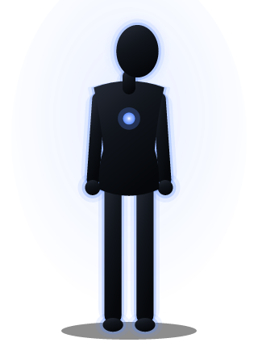
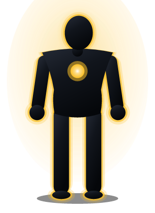

# 🎮 Ruta Propia · RPG 2D de mundo abierto sobre desarrollo personal y negocios

Un RPG de **mundo abierto en 2D** donde lo primero y más importante que haces es
**definir las características de tu avatar**. A partir de ahí sales a una ciudad
viva a hacer lo mismo que en la vida real: **entrenar, aprender, conocer gente,
trabajar, emprender y escalar** — y ver cómo tu personaje cambia con ello.

> El avatar **no se dibuja a mano**: se genera con tus características. Su
> complexión, su postura, la apertura de sus brazos, el halo mental y el núcleo
> de energía del pecho salen directamente de lo que has desarrollado.


| Empiezas así | Con el tiempo | 
|---|---|
|  |  |

## ▶️ Jugar

Abre **`juego.html`** en cualquier navegador moderno. No hay nada que instalar
ni que compilar: estructura, estilos y lógica están dentro del mismo archivo.

```bash
# opcional: servirlo en local
python3 -m http.server 8000   # y visita http://localhost:8000/juego.html
```

**Controles:** `W A S D` o flechas para moverte · `E` para interactuar delante de
una puerta o de un punto brillante · `P` perfil · `N` negocios · `Q` misiones ·
`M` mapa · `L` diario · `Esc` cerrar. En móvil aparecen un mando y un botón **E**.

## 🧬 1. Creas tu personaje con características

Repartes **60 puntos** entre ocho características (base 10, máximo 35 al empezar).
Lo que no gastes te lo llevas al juego.

| | Característica | Para qué sirve |
|---|---|---|
| 💪 | **Vigor** | Energía máxima, aguante y recuperación |
| 🧠 | **Intelecto** | Aprendizaje, análisis y estrategia |
| 🎯 | **Disciplina** | Gastas menos energía y mantienes rachas |
| 🗣️ | **Carisma** | Ventas, negociación y contactos |
| 🎨 | **Creatividad** | Ideas, producto y diferenciación |
| 💰 | **Finanzas** | Márgenes, inversión y control del dinero |
| 🤝 | **Liderazgo** | Equipo, delegación y alianzas |
| 🧘 | **Equilibrio** | Estrés, ánimo y sostenibilidad |

Además eliges **trasfondo** (Estudiante, Empleado, Autodidacta, Comercial,
Deportista, Heredero — cambian dinero, deuda y bonus iniciales) y un **rasgo
distintivo** (Madrugador, Networker, Ahorrador, Resiliente, Analítico,
Incansable). Todo se refleja en el avatar en tiempo real mientras lo configuras.

## 🌍 2. Sales a un mundo abierto

Una ciudad de **108 × 84 casillas** con cinco distritos y **20 lugares**, cada
uno con sus propias acciones (más de 70 en total):

- **🌳 Norte** — tu apartamento, Gimnasio Titán, Centro Zen, Centro de Salud, Parque Sol
- **⛲ Centro** — Biblioteca Central, Café Aroma, Universidad, Club Social, Plaza Mayor
- **🏦 Financiero** — Banco Meridiano, Torre Corporativa, Coworking Nodo, Incubadora Impulso
- **🛒 Sur** — Mercado Central, Bazar Suministros, Escuela de Oficios, Estudio Creativo, Centro de Ferias
- **⚓ Costa** — Muelle del Sur

Por la ciudad pasean **seis personajes** (una comerciante, un entrenador, una
inversora, un librero, una artista y un médico) que dan consejo y, la primera
vez que hablas con ellos, algo más.

## ⚙️ 3. Los sistemas del juego

- **Tiempo y energía** — el día va de las 7:00 a las 24:00; cada acción cuesta
  horas, energía y a veces dinero. Dormir cierra el día.
- **Estado** — energía, estrés, ánimo y reputación afectan a cuánto rindes:
  quemado y sin dormir aprendes y facturas menos.
- **Progresión** — cada acción da experiencia a características concretas; al
  subir de nivel recibes 3 puntos para repartir donde quieras.
- **Dinero** — nómina, trabajos por horas, gastos diarios, ahorro con interés,
  préstamos con un 1 % diario y descubierto que se convierte en deuda.
- **Negocios** — registra hasta 4 (puesto de mercado, tienda online, agencia,
  cafetería, startup). Cada modelo rinde según **características distintas**:
  suben de nivel, contratan, hacen marketing, mejoran producto y marca, y se
  pueden vender.
- **Misiones** — diez pasos encadenados desde "haz 3 acciones de desarrollo"
  hasta **libertad financiera** (que tus ingresos pasivos superen tus gastos).
- **Logros, hábitos y rachas** — dos acciones de desarrollo al día mantienen la
  racha y dan experiencia extra.
- **Objetos** — ocho compras únicas (portátil, traje, bici, colchón, cafetera,
  agenda, biblioteca, gimnasio en casa) que cambian cómo juegas.
- **Eventos** — cada día pasa algo: un cliente que te recomienda, una avería,
  impuestos, una gripe si acumulas estrés, una idea al despertar…
- **Guardado automático** en el navegador (`localStorage`), con botón 💾 y
  opción de continuar la partida al abrir el juego.

## 🧪 Desarrollo

La app no tiene dependencias en tiempo de ejecución. Las pruebas corren en Node
y **leen el código directamente del `<script>` embebido**, así que validan
exactamente lo que se ejecuta en el navegador.

```bash
npm install          # sólo para pruebas y previsualización
npm test             # lógica pura: mundo, simulación, economía, avatar (~645.000 comprobaciones)
npm run test:dom     # integración real con jsdom: crear personaje, jugar, abrir paneles
npm run test:all     # todo
npm run preview:game # regenera docs/mapa.png y los avatares de ejemplo
```

`npm test` incluye, entre otras cosas:

- **40 semillas de mundo** comprobando por inundación que se puede llegar
  caminando a **todas** las puertas y puntos de interés (nada queda encerrado).
- **12 partidas completas de 120 días** (todas las combinaciones de trasfondo y
  rasgo) verificando en cada acción que ninguna magnitud se sale de rango,
  que la caja nunca queda en negativo y que ningún valor se vuelve `NaN`.
- **200 perfiles aleatorios** de avatar y radar sin coordenadas inválidas.
- Reglas de acción (energía, dinero, horario, requisitos, una vez al día),
  banco, negocios, misiones sin recompensa duplicada y **determinismo por
  semilla**.

## 📁 Estructura

```
juego.html         EL JUEGO: mundo abierto + creación de personaje (HTML + CSS + JS)
index.html         Diseñador de Personajes con diagnóstico de vida (herramienta aparte)
load-game.js       Extrae la lógica del juego desde juego.html para Node
test-game.js       Pruebas de mundo, simulación, economía y avatar
test-game-dom.js   Integración con jsdom: crear personaje, entrar, actuar, guardar
preview-game.js    Genera docs/mapa.png y los avatares de ejemplo
load-app.js        Ídem para el diseñador (index.html)
test-render.js     Pruebas del diseñador
test-dom.js        Integración del diseñador con jsdom
preview.js         PNGs de muestra del diseñador
gen-hero.js        Genera docs/captura.png
```

## 🧭 El diseñador de personajes

`index.html` sigue disponible como herramienta independiente: describes un perfil
real (habilidades, personalidad y hábitos) y obtiene un **diagnóstico** de seis
dimensiones con fortalezas, carencias y un plan de mejora.

## ⚠️ Aviso

Es un **juego** y una herramienta de reflexión, no un diagnóstico médico,
psicológico ni asesoramiento financiero. Las cifras de negocio son una
simplificación pensada para jugar. Si algo de tu vida real (sueño, estrés,
ánimo, dinero) te preocupa, habla con un profesional.
