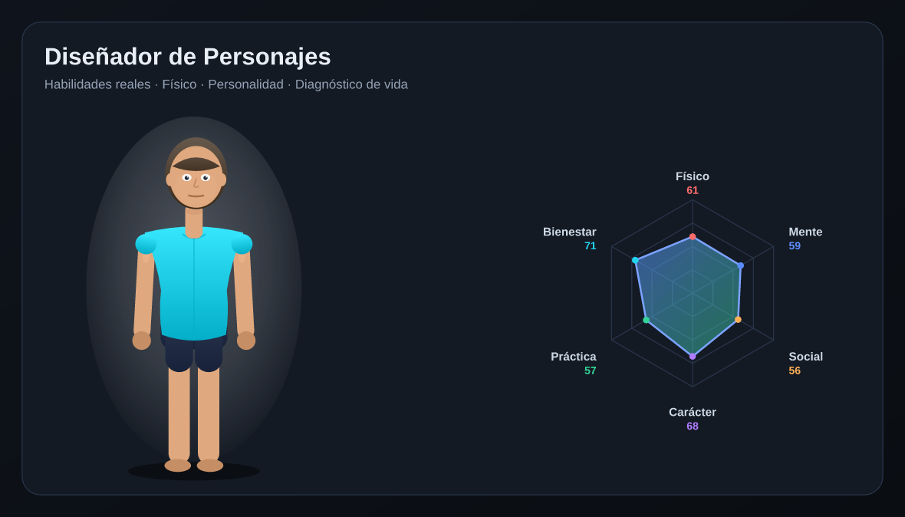

# 🧬 Diseñador de Personajes · Diagnóstico de Vida

Crea un personaje basado en **habilidades de la vida real**, **características físicas**,
**rasgos de personalidad** y **hábitos**, y obtén un **diagnóstico** de su condición
actual junto con un **plan concreto de mejora**.

Funciona como una *plantilla de autoconocimiento*: defines cómo es alguien (tú mismo, por
ejemplo) y la herramienta calcula sus dimensiones, identifica fortalezas y carencias y
sugiere qué cambiar o reforzar.



## ✨ Qué incluye

- **Avatar visual en vivo (SVG)** que cambia con cada atributo:
  - Complexión (delgada / media / atlética / robusta) y estilo de figura.
  - Altura, tono muscular y postura.
  - Tono de piel, color de cabello y peinado (rapado, corto, medio, largo).
  - **Aura de vitalidad** y **expresión facial** que reflejan tu estado general.
  - El color de la ropa refleja tu dimensión dominante.
  - 100 % vectorial → nítido a cualquier tamaño, sin pixelado ni artefactos de textura.

- **Editor detallado** con más de 30 atributos organizados en grupos:
  - 🏃 Físicas · 🧠 Mentales · 🗣️ Sociales · 🛠️ Prácticas
  - 🧩 Personalidad (modelo OCEAN: apertura, responsabilidad, extraversión, amabilidad, estabilidad)
  - 🌿 Hábitos y estilo de vida (sueño, alimentación, actividad, estrés, conexión, vitalidad)

- **Diagnóstico** sobre 6 dimensiones (Físico, Mente, Social, Carácter, Práctica, Bienestar):
  - Gráfico **radar**, puntuación de **condición general** y etiqueta (Crítica → Excepcional).
  - **Arquetipo** del personaje (El Atleta, El Estratega, El Conector, El Polímata…).
  - **Fortalezas** y áreas **a reforzar**.
  - **Plan de mejora** con acciones específicas por dimensión y alertas de hábitos.

- **Extras**: ejemplos predefinidos, generador aleatorio, guardado local,
  exportar el avatar como **SVG** y el diagnóstico como **informe de texto**.

## 🚀 Uso

No requiere instalación ni servidor. Abre `index.html` en cualquier navegador moderno.

```bash
# opcional: servirlo en local
python3 -m http.server 8000
# luego visita http://localhost:8000
```

Todo el procesamiento ocurre en tu navegador; nada se envía a ningún servidor.

## 🧪 Desarrollo

Las pruebas y la previsualización corren en Node (solo para desarrollo; la app no
tiene dependencias en tiempo de ejecución):

```bash
npm install        # instala el rasterizador SVG (solo para pruebas/preview)
npm test           # valida el SVG (sin NaN/undefined), rangos y diagnóstico
npm run preview    # genera PNGs de muestra del avatar y el radar
```

`npm test` ejecuta cientos de estados (incluidos extremos y todos los peinados/complexiones)
y falla si detecta coordenadas inválidas, atributos vacíos o artefactos de render.

## 📁 Estructura

```
index.html       Estructura de la página
styles.css       Tema oscuro y diseño responsivo
app.js           Estado, render del avatar/radar y motor de diagnóstico
test-render.js   Pruebas de humo de las funciones puras
preview.js       Genera PNGs de muestra (requiere @resvg/resvg-js)
```

## ⚠️ Aviso

Es una guía de **autoconocimiento y reflexión**, no un diagnóstico médico, psicológico
ni profesional. Si algún área (sueño, estrés, ánimo) te preocupa, consulta a un especialista.
