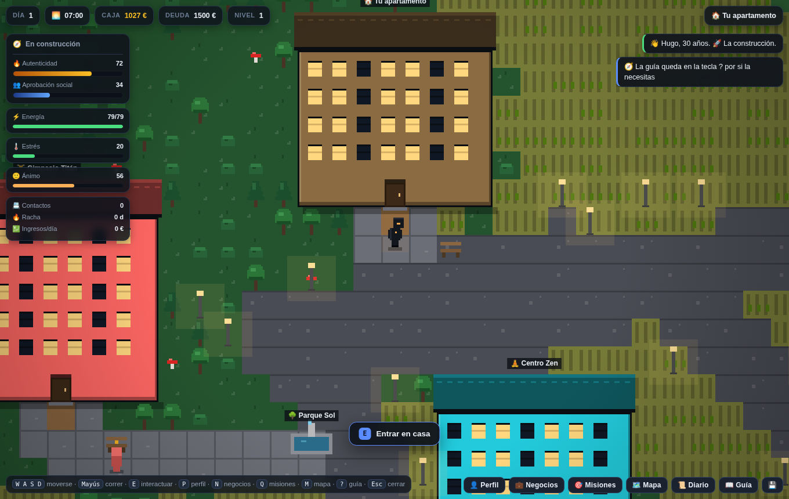
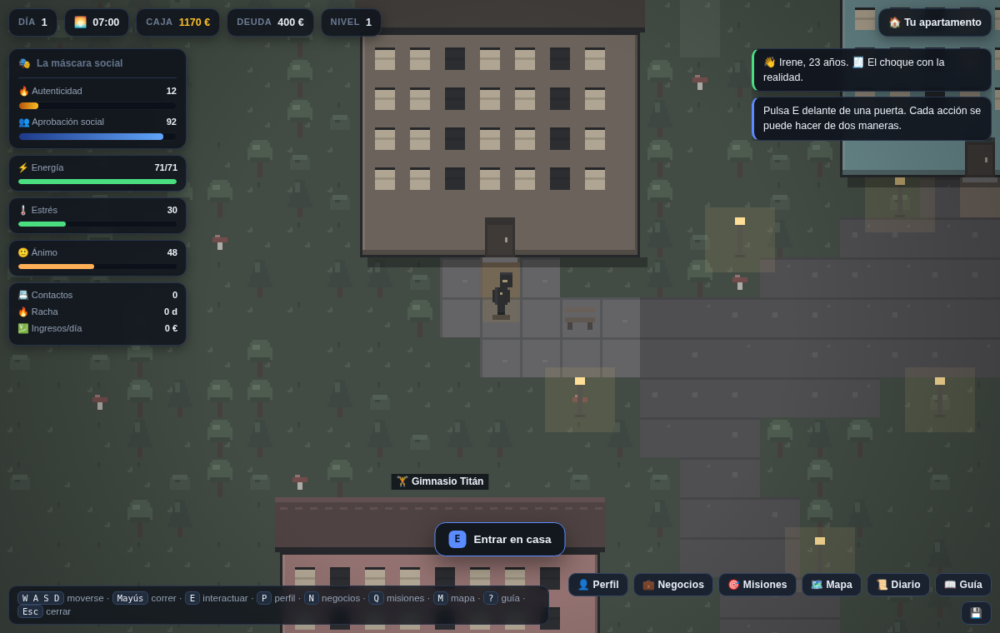
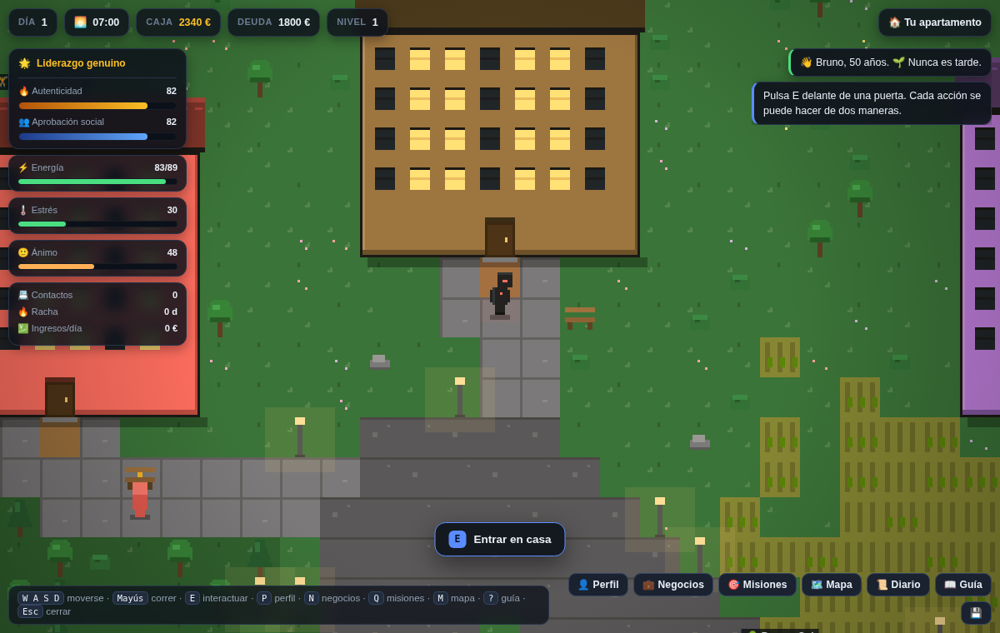
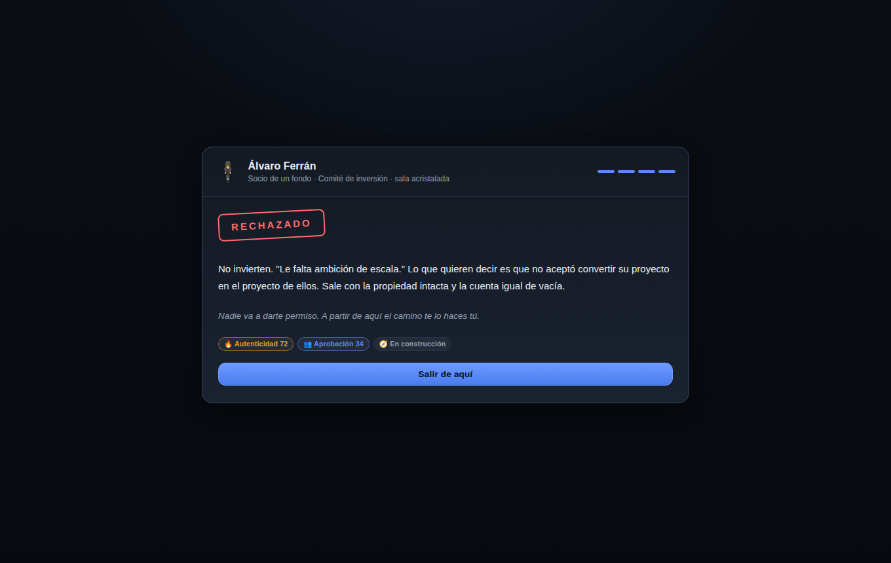
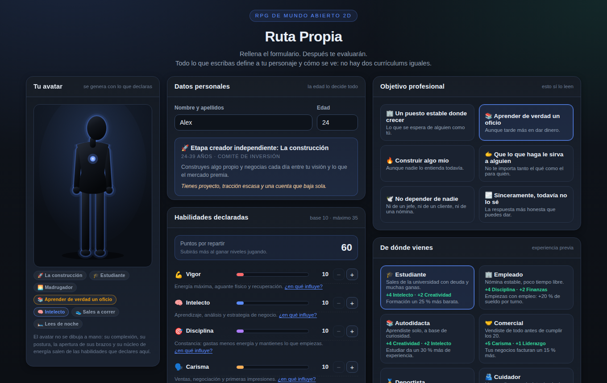
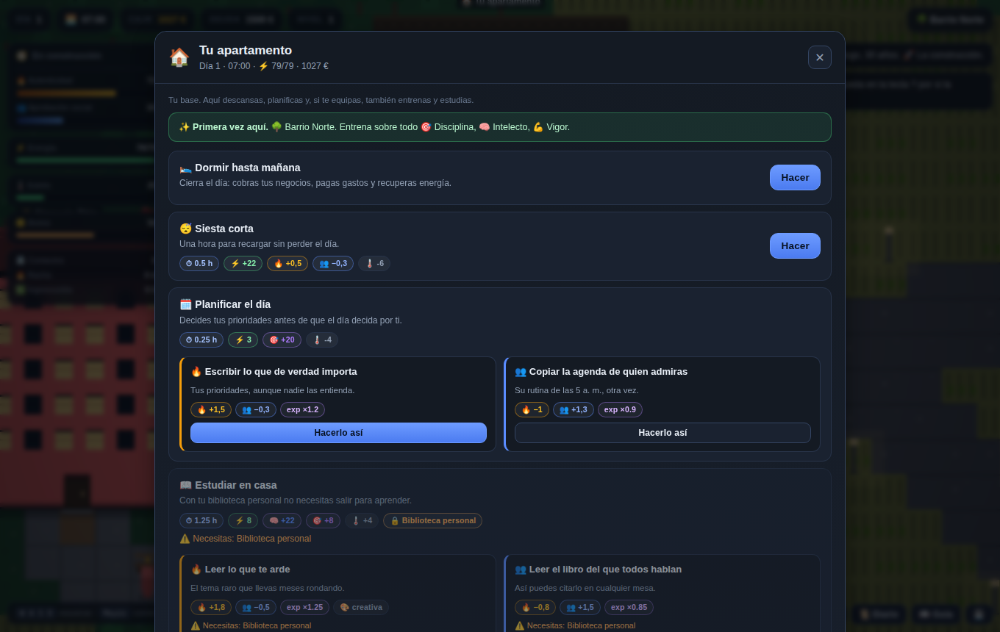
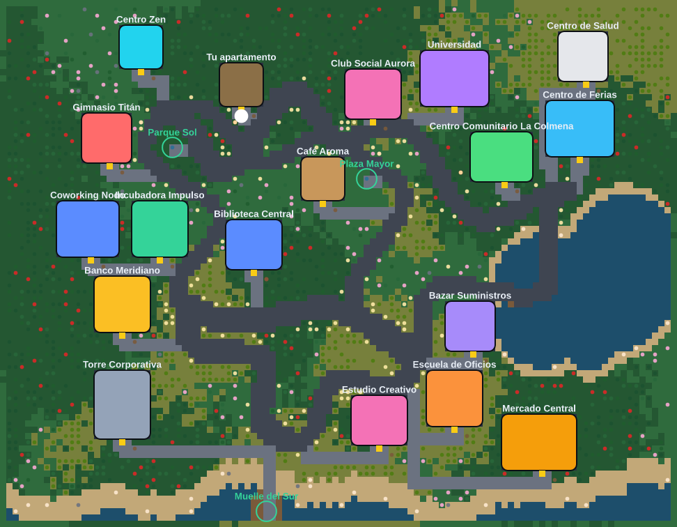
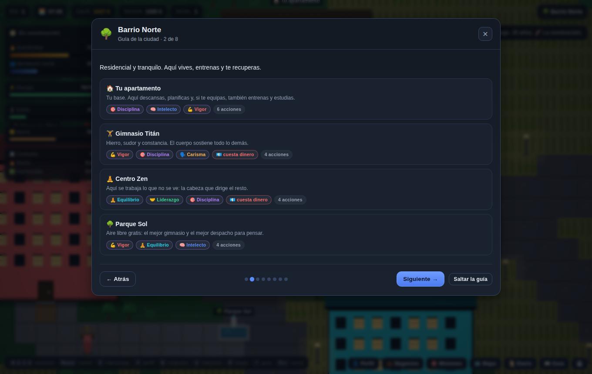
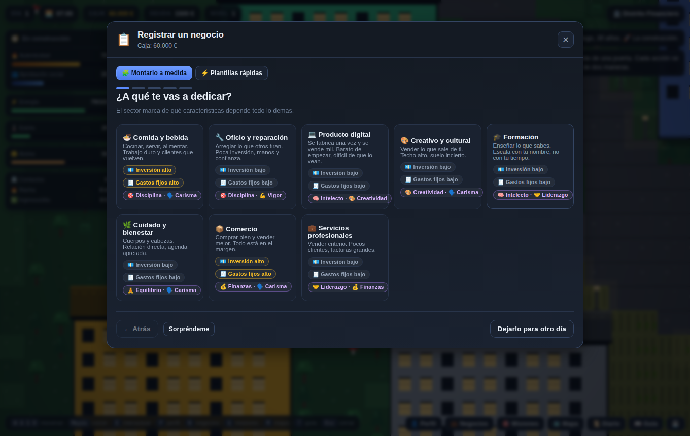
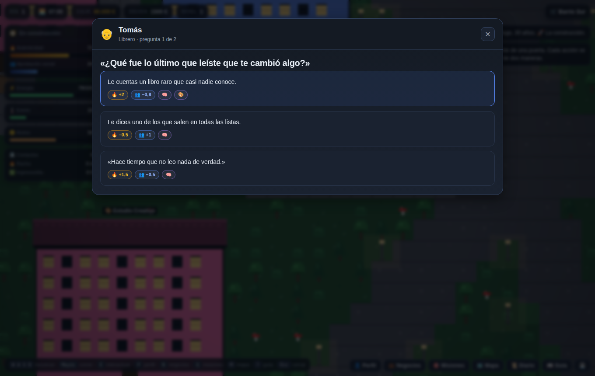

# 🎮 Ruta Propia · El mundo del propósito

Un RPG de **mundo abierto 2D en pixel art** sobre lo que cuesta construir una vida
propia. Rellenas un currículum, te evalúan, **te rechazan** — siempre — y a partir
de ahí sales a una ciudad a decidir, una y otra vez, entre **encajar** y **ser fiel
a ti mismo**.

> «Romper la mente para cambiar la vida».
> Cada acción del juego se puede hacer de dos maneras. Ninguna es gratis.



## ⚖️ Los dos ejes

Todo el juego se mueve entre dos fuerzas que casi nunca tiran hacia el mismo lado:

| | Eje | Sube cuando… | Baja cuando… |
|---|---|---|---|
| 🔥 | **Autenticidad** | decides según tus valores, aprendes lo que te importa, creas algo tuyo | cedes a la presión del grupo o ignoras lo que piensas |
| 👥 | **Aprobación social** | encajas, complaces, dices lo que quieren oír | pones límites o tomas un camino que nadie entiende |

Es *paz interior y sentido de dirección* contra *estatus y cómo te ven*. La partida
consiste en negociar entre las dos sin romperte.

**Los dos ejes se mueven despacio a propósito.** Una vida no cambia de rumbo en una
tarde, así que el juego lo impide de tres maneras:

- Cada movimiento vale **una cuarta parte** de lo que marca la acción.
- Al acabar el día no puedes estar a **más de 4 puntos** de donde amaneciste, hagas lo
  que hagas y vengan de donde vengan.
- Repetir hoy la misma acción rinde cada vez menos: la quinta vez ya casi no dice
  nada nuevo de ti.

Pasar de 45 a 70 de autenticidad cuesta **semanas de constancia**, no una tarde de
decisiones acertadas.

### 🕰️ Días largos, vida lenta

El día va de las 7:00 **a las 2:00 de la madrugada** y las acciones cuestan bastante
menos tiempo y energía de lo que dice su ficha, así que en una jornada caben muchas
cosas. A cambio, cada una aporta la mitad de experiencia y subir de nivel cuesta más
del doble. Los días cunden; la vida sigue tardando en cambiar. Un jugador que optimice
tarda unos **40 días** en llegar al final bueno, y bastante más si juega a su aire.

### 💚 Ganar aprobación sin venderte

Ser fiel a ti mismo *suele* costar aprobación, pero no siempre. Hay tres caminos
honestos para que la gente te acepte sin dejar de ser tú:

1. **17 decisiones que suben las dos barras.** Enseñar de verdad, contar también lo
   que salió mal, colaborar con quien admiras, echar una mano en el mercado, negociar
   de frente. Se marcan con 💚 en la interfaz.
2. **El Centro Comunitario La Colmena**, un lugar entero dedicado a ello: voluntariado,
   mentorizar a alguien que empieza, escuchar sin dar consejos, organizar algo para el
   barrio. Cada acción tiene su versión sincera (💚 sube las dos) y su versión de cara a
   la galería (más aprobación, menos autenticidad).
3. **La coherencia.** Mantén la autenticidad por encima de 60 durante cinco días
   seguidos y la gente empieza a respetar que no cambies según quién mire: la aprobación
   sube sola, cada día un poco más.

## 🌗 Los tres estados

De la combinación de ambos ejes sale un estado que cambia **la interfaz, el color
del mundo y lo que puedes hacer**:

| Estado | Condición | Qué pasa |
|---|---|---|
| 🕳️ **Ostracismo incomprendido** | aprobación < 20 | Parte de la gente deja de hablarte. Pero si además tienes la autenticidad alta se enciende el **enfoque láser**: aprendes un 35 % más rápido. |
| 🎭 **La máscara social** | aprobación > 80 y autenticidad < 30 | Validación fácil, y el mundo entero **se apaga**: paleta gris, menos energía máxima, el estrés sube un 40 % más y **se bloquean las opciones creativas**. |
| 🌟 **Liderazgo genuino** | ambos > 70 | Impactas de verdad. La gente te busca, tus proyectos rinden un 18 % más y aguantas más. Es el estado más difícil de sostener. |

| Con la máscara puesta | En liderazgo genuino |
|---|---|
|  |  |

## 📄 1. El currículum y el rechazo inevitable

La partida empieza rellenando un formulario. La decisión clave es la **edad**: define
tu etapa de vida, contra qué te vas a estrellar y quién te va a rechazar.

| Etapa | Edad | El choque | Quién te evalúa |
|---|---|---|---|
| 🎒 **El despertar** | 14-17 | Pertenecer al grupo o descubrir quién eres | El orientador escolar, en la feria de proyectos |
| 🧾 **El choque con la realidad** | 18-23 | Ingresos ya, o construir algo propio | Selección de personal de una cadena de tiendas |
| 🚀 **La construcción** | 24-39 | Tu visión o lo que el mercado premia | Un socio de un fondo, en el comité de inversión |
| 🌱 **Nunca es tarde** | 40+ | "Ya es tarde" contra empezar otra vez | Un comité de contratación que te ve mayor |

Cada etapa tiene **su propia entrevista** con cuatro preguntas y tres respuestas cada
una. Responder con la verdad, decir lo que quieren oír o quedarte en medio cambia los
dos ejes… pero **el resultado siempre es un rechazo**. Ése es el detonante: nadie te
va a dar permiso.



También declaras tu **objetivo profesional** entre seis (la primera decisión real del
juego), tu **experiencia previa** entre diez, un **rasgo distintivo** entre diez, **dos
aficiones o manías** entre diez, y repartes **60 puntos** entre ocho habilidades.

Ninguna afición es gratis: cocinar abarata la vida pero te quita energía; el insomnio te
hace rendir de noche y dormir peor; no saber decir que no te da más aprobación cuando
complaces… y te cuesta más autenticidad. Las experiencias previas van del estudiante
endeudado al cuidador que lleva años ocupándose de otro, y cada una cambia tu dinero,
tus deudas y tus gastos de partida.

El avatar se genera con todo eso: complexión, postura, apertura de brazos, halo mental y
núcleo de energía salen de lo que has declarado.



## 🔀 2. Cada acción, dos maneras de hacerla

67 de las 80 acciones del juego plantean un dilema. La vía auténtica suele enseñar más
y costar aprobación; la complaciente paga antes y te vacía por dentro.



Las pastillas de cada vía muestran **lo que va a pasar de verdad**, no el valor bruto
del dato: ya llevan aplicados el ritmo lento, el estado en que estás, lo que llevas
repetido hoy y lo que te queda de tope diario. Si repites la misma acción, ves bajar
el número antes de pulsar.

Unos ejemplos reales del juego:

| Acción | 🔥 A tu manera | 👥 Como se espera |
|---|---|---|
| Entrenar | Tu progresión, sin público | Series para el espejo |
| Trabajar | Hacer el trabajo bien | Hacer lo que luce ante el jefe (**+20 % de sueldo**) |
| Pitch a inversores | Contar el proyecto que tienes | Contar el proyecto que quieren financiar |
| Hablar en público | Contar también lo que salió mal | Contar sólo la parte que brilla |
| Mejorar el producto | Arreglar lo que sabes que está mal | Añadir lo que piden los que gritan |

Las trece acciones sin dilema tampoco son neutras: dormir y el banco no juzgan a nadie,
pero **el muelle** (nadar, pescar, ver el atardecer, pensar en tu rumbo) sube la
autenticidad y baja la aprobación siempre. Es el sitio del mapa donde nadie entiende
qué haces ahí.

## 🌍 3. El mundo

Una ciudad de **108 × 84 casillas** en pixel art generado por código, con seis barrios
y **21 lugares**. **No hay rejilla**: la ciudad se construye entera en cada partida — los
barrios caen en sitios distintos, las calles serpentean entre ellos y cada edificio se
coloca alrededor de su barrio con ángulo y distancia al azar. Después se talla un sendero
desde cada puerta hasta la calle más cercana, así que nunca queda un sitio inaccesible.

- **🌳 Barrio Norte** — tu apartamento, Gimnasio Titán, Centro Zen, Parque Sol
- **⛲ Centro** — Biblioteca Central, Café Aroma, Universidad, Club Social, Plaza Mayor
- **🤝 Ribera Este** — Centro de Salud, Centro Comunitario La Colmena, Centro de Ferias
- **🏦 Distrito Financiero** — Banco Meridiano, Torre Corporativa, Coworking Nodo, Incubadora Impulso
- **🛒 Barrio Sur** — Mercado Central, Bazar Suministros, Escuela de Oficios, Estudio Creativo
- **⚓ Costa** — Muelle del Sur



Se recorre andando o **corriendo con `Mayús`** (casi el doble de rápido, y el Vigor se
nota). Por la ciudad pasean **siete personajes** y no todos te tratan igual: la inversora
deja de atenderte si caes en el ostracismo, y el librero y la artista se enfrían contigo
si te pones la máscara.

## 📖 4. El tutorial y la guía

Nada más salir de la entrevista, un **recorrido por los seis barrios** explica qué hay en
cada uno y para qué sirve: qué características entrena cada lugar, si allí se cobra o se
paga y dónde hay decisiones que suman en las dos barras. Se puede saltar, y queda
disponible para siempre con la tecla `?` o desde el mapa. Además, la primera vez que
entras a un sitio, una nota te dice de un vistazo qué vas a encontrar dentro.



Y cada característica explica **exactamente en qué influye**: en el currículum y en el
perfil puedes desplegar sus efectos concretos ("abarata la energía de todas las acciones
hasta un 24 %", "el banco te presta 60 € más por punto"), qué cambia en tu avatar y dónde
se entrena. En el perfil, además, se traduce a lo que significa hoy con tu valor actual.

## ⚙️ 5. Los sistemas

- **Tiempo y energía** — el día va de las 7:00 a las 24:00; cada acción cuesta horas,
  energía y a veces dinero. Dormir cierra el día.
- **Estado** — energía, estrés y ánimo afectan al rendimiento; la autenticidad también
  (vivir sin rumbo propio te resta hasta un 12 %).
- **Progresión** — ocho características (Vigor, Intelecto, Disciplina, Carisma,
  Creatividad, Finanzas, Liderazgo, Equilibrio), experiencia por acción y 3 puntos a
  repartir por nivel.
- **Dinero** — nómina, trabajos por horas, gastos diarios, ahorro con interés, préstamos
  al 1 % diario y descubierto que se convierte en deuda.
- **Negocios** — se montan pieza a pieza (ver abajo) y **rinden según tu estado**:
  vender humo con la máscara puesta paga menos que aportar valor real.
- **Misiones** — diez pasos desde "sobrevive al rechazo" hasta el liderazgo genuino.
- **Equipo con doble lectura** — catorce objetos que puedes comprar y revender por el
  45 %: el traje y el móvil suben la aprobación y bajan la autenticidad, el cuaderno de
  ideas y las herramientas hacen lo contrario, y el coche y el local traen gastos fijos.
- **Eventos, hábitos, rachas y logros**, y guardado automático en el navegador.
- **Diario detallado** — cada acción queda anotada con su desglose completo (cuánto se
  movió cada eje, qué aprendiste, qué te costó), separado por días, y el cierre de cada
  jornada se guarda entero. Los avisos en pantalla duran 11 segundos y se congelan si
  pasas el ratón por encima.

## 🏭 6. El negocio que tú quieras

No eliges entre cinco modelos cerrados: **montas el tuyo pieza a pieza**, y cada decisión
cambia la inversión, los ingresos, el riesgo y de qué características depende.

| Pieza | Opciones | Qué cambia |
|---|---|---|
| **Sector** | Comida, oficio, digital, creativo, formación, cuidado, comercio, servicios | De qué características depende, la inversión y los costes fijos |
| **Público** | El barrio, un nicho, el público general, otras empresas, quien puede pagar mucho | Cuánto factura, cuánto cuesta entrar y cuánto riesgo corres |
| **Producto** | Lo escribes tú (con sugerencias por sector) | Es lo que verá todo el mundo |
| **Modelo** | Venta suelta, suscripción, por horas, por encargo, a comisión | Si los ingresos son estables y si el negocio **escala o no** |
| **Enfoque** | Barato y masivo, cuidado, rápido, honesto aunque cueste, ruidoso | El margen, el volumen y cuánto se te parece |

Son **1.000 combinaciones**, y no son cosméticas. Vender horas paga bien desde el primer
día pero apenas crece con el nivel: estás vendiendo tu tiempo. Una suscripción a un nicho
concreto entra poquito y todos los días. Un negocio ruidoso de lujo puede facturar 283 €
un día y 67 € al siguiente. Y el enfoque te marca: montar algo honesto sube tu
autenticidad, montar algo ruidoso sube tu aprobación.



Si no quieres decidirlo todo, hay **cinco plantillas** ya montadas y un botón de
*Sorpréndeme*.

## 💬 7. Conversaciones

Hablar con alguien no es pulsar un botón: cada personaje tiene **conversaciones de dos
turnos con tres respuestas cada una**, y lo que contestas te mueve los ejes, te enseña
cosas y a veces abre puertas. Hay más de treinta turnos escritos entre los siete
personajes del mapa.



Las conversaciones esperan a su momento: la inversora sólo te habla de escalar cuando ya
estás facturando, el librero te pregunta por lo que has dejado de decir cuando llevas
tiempo con la máscara puesta, y el médico cambia de tema cuando llegas con el estrés por
las nubes. Un signo dorado sobre la cabeza avisa de que alguien tiene algo que contarte.

## 🏁 8. Los finales

La partida termina cuando un estado se sostiene en el tiempo:

- 🌟 **Liderazgo genuino** — 8 días con ambos ejes por encima de 70. El final bueno.
- 🎭 **La máscara se quedó pegada** — 18 días complaciendo con la autenticidad por los suelos.
- 🕳️ **El desierto** — 18 días aislado *y* sin rumbo propio.

Estar en el ostracismo con la cabeza clara **no es un final**: es un sitio incómodo
donde se puede vivir y crear. Al llegar a un final puedes leer el epílogo y elegir entre
empezar otra vida o seguir jugando.

## ▶️ Jugar

Abre **`juego.html`** en cualquier navegador moderno. No hay nada que instalar.

```bash
python3 -m http.server 8000   # y visita http://localhost:8000/juego.html
```

**Controles:** `W A S D` o flechas para moverte · `Mayús` para correr · `E` para
interactuar · `P` perfil · `N` negocios · `Q` misiones · `M` mapa · `L` diario ·
`?` guía · `Esc` cerrar. En móvil aparecen un mando, un botón **E** y otro para correr.

## 🧪 Desarrollo

La app no tiene dependencias en tiempo de ejecución. Las pruebas corren en Node y **leen
el código directamente del `<script>` embebido**, así que validan exactamente lo que se
ejecuta en el navegador.

```bash
npm install          # sólo para pruebas y previsualización
npm test             # lógica pura (~715.000 comprobaciones)
npm run test:dom     # integración real con jsdom: currículum → entrevista → guía → mundo
npm run test:all     # todo
npm run preview:game # regenera docs/mapa.png y los avatares
node shots.js        # regenera las capturas del README (necesita playwright-core)
```

`npm test` comprueba, entre otras cosas:

- Que **las dos vías de cada acción tiran de verdad en direcciones opuestas**: la
  auténtica siempre da más autenticidad y la complaciente siempre la baja; y que las
  marcadas como 💚 sanas —y sólo ésas— suman también aprobación.
- Que **el ritmo es lento**: una acción mueve menos de 3 puntos, ningún día te aleja más
  de 4 de donde amaneciste, y llegar a 70 de autenticidad exige varios días de decisiones
  distintas.
- Que **las 1.000 combinaciones de negocio** se pueden montar y ninguna produce números
  rotos, que vender horas escala peor que una suscripción y que montar algo honesto deja
  otra huella que montar algo ruidoso.
- Que **las conversaciones** están bien formadas: todas ofrecen en cada turno una salida
  auténtica y otra complaciente, no se repiten al terminarlas y esperan a su condición.
- Que **las aficiones** cumplen su parte buena y su parte mala, y que el equipo se puede
  comprar, usar y revender.
- Que **lo que la interfaz promete es lo que ocurre**: para cada acción y cada vía del
  catálogo, la previsión que se enseña en pantalla coincide exactamente con lo que aplica
  el motor, incluso al repetir la acción o con el tope del día agotado. Y que ninguna
  fuente —misiones, eventos, el desenlace de un pitch— puede saltarse ese tope.
- Que **la coherencia paga**: con la misma semilla, quien se mantiene fiel acaba con más
  aprobación que quien no.
- Que **la ciudad no es una cuadrícula**: en 25 semillas los edificios ocupan al menos 14
  columnas distintas y cada lugar cae en un sitio diferente en cada partida, sin dejar de
  agruparse por barrios.
- Que **correr** acelera de verdad, que sin fuelle no se puede y que el Vigor se nota.
- Que **el diario guarda el desglose** de cada acción sin repetir lo que ya tiene entrada
  propia.
- Que **la entrevista acaba en rechazo se responda como se responda**, en las cuatro
  etapas y con las tres columnas de respuestas.
- Los umbrales de los **tres estados**, que la máscara bloquea lo creativo y baja el
  techo de energía, y que el enfoque láser sólo se enciende con autenticidad alta.
- Los **cuatro finales**, incluido que el ostracismo con rumbo propio *no* termina la partida.
- **12 partidas completas de 120 días** con dos formas de jugar (fiel a uno mismo y
  complaciente), verificando en cada acción que ninguna magnitud se sale de rango y
  que jugar de una manera u otra lleva a sitios distintos.
- **40 semillas de mundo** comprobando por inundación que se llega a pie a todos los
  lugares, 200 avatares sin coordenadas inválidas y determinismo por semilla.

## 📁 Estructura

```
juego.html         EL JUEGO: currículum, entrevista y mundo abierto (HTML + CSS + JS)
index.html         Diseñador de Personajes con diagnóstico de vida (herramienta aparte)
load-game.js       Extrae la lógica del juego desde juego.html para Node
test-game.js       Pruebas de ejes, estados, dilemas, mundo, economía y finales
test-game-dom.js   Integración con jsdom: rellenar el CV, ser rechazado, jugar y guardar
preview-game.js    Genera docs/mapa.png y los avatares de ejemplo
shots.js           Regenera las capturas del README abriendo el juego de verdad
load-app.js · test-render.js · test-dom.js · preview.js · gen-hero.js   (del diseñador)
```

## ⚠️ Aviso

Es un **juego** y una herramienta de reflexión, no un diagnóstico psicológico ni
asesoramiento financiero. Las cifras de negocio son una simplificación pensada para
jugar. Si algo de tu vida real (ánimo, estrés, dinero, sensación de no encajar) te
preocupa, habla con un profesional.
